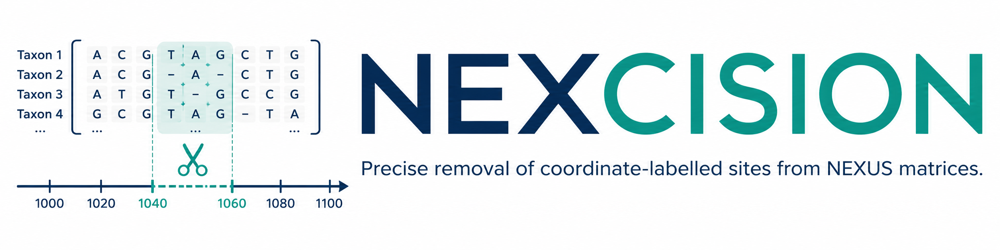
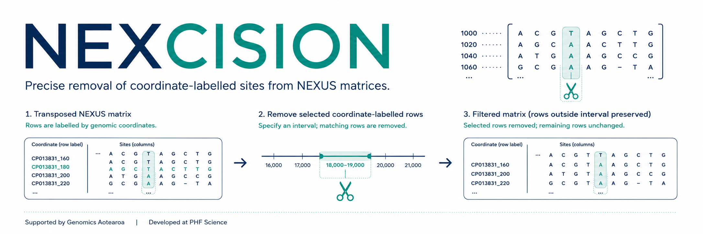

<p align="center">
  
</p>

<p align="center">
  <a href="https://github.com/RhysWhite/nexcision/actions/workflows/tests.yml">
    
  </a>
  <a href="https://www.python.org/downloads/">
    
  </a>
  <a href="https://github.com/RhysWhite/nexcision/releases">
    
  </a>
  <a href="LICENSE">
    
  </a>
</p>

<p align="center">
  <strong>Precise removal of coordinate-labelled sites from NEXUS matrices.</strong>
</p>

NEXCISION is a dependency-free Python command-line tool for reproducibly removing matrix rows whose genomic coordinates fall within user-specified intervals, while preserving the remaining structure and content of the NEXUS file.

It is designed primarily for transposed NEXUS matrices in which each row represents a genomic site and the first token ends with its coordinate:

```text
CP013831_180    01001101
```

In this example, `180` is the genomic coordinate used to determine whether the row should be retained or removed.

## Key features

- **Precise** — removes only rows with coordinates inside defined genomic intervals.
- **Reproducible** — optionally records parameters, results, and SHA-256 checksums in a deterministic JSON report.
- **Safe** — validates input files and refuses to overwrite outputs unless explicitly instructed.
- **Transparent** — reports removal counts for every input region, including overlapping regions.
- **Portable** — requires only Python 3.10 or newer and has no runtime dependencies.
- **NEXUS-aware** — safely updates `ntax` or transposed-matrix `nchar` values when appropriate.

## Quick start

### Install from GitHub

```bash
python -m pip install git+https://github.com/RhysWhite/nexcision.git
```

Alternatively, clone the repository and install it locally:

```bash
git clone https://github.com/RhysWhite/nexcision.git
cd nexcision
python -m pip install .
```

### Run NEXCISION

```bash
nexcise input.nex regions.tsv \
  --output filtered.nex \
  --counts removed_counts_per_region.tsv \
  --report nexcision_report.json
```

Existing outputs are not overwritten unless `--force` is supplied.

## How it works

<p align="center">
  
</p>

NEXCISION reads the genomic coordinate from the first token of each matrix row, compares it against the supplied intervals, and removes matching rows. Rows outside those intervals are retained unchanged.

## Input files

### NEXUS matrix

By default, NEXCISION extracts the terminal integer following an underscore in the first token of each matrix row:

```text
CP013831_160    01001101
CP013831_180    11000110
CP013831_200    01011001
```

The default coordinate pattern is:

```text
_(\d+)$
```

A different identifier format can be handled with `--position-regex`. The expression must contain exactly one capture group representing the coordinate:

```bash
nexcise input.nex regions.tsv \
  --position-regex 'site:(\d+)$'
```

Matrix rows that cannot be parsed are rejected by default. Use `--allow-unparsed` only when unmatched rows should be retained unchanged.

### Regions file

The regions file is whitespace-delimited. Coordinates are **1-based and inclusive**. A third name column is optional.

```text
start   end   name
170     260   recombination_block_1
300     350   recombination_block_2
```

Blank lines and lines beginning with `#` are ignored. Reversed start and end coordinates are normalised automatically.

## Outputs

NEXCISION can produce three outputs:

| Output | Description |
|---|---|
| `filtered.nex` | NEXUS file with matching coordinate-labelled rows removed. |
| `removed_counts_per_region.tsv` | Number of removed rows associated with each supplied interval. |
| `nexcision_report.json` | Optional run metadata, parameters, results, warnings, and SHA-256 checksums. |

Overlapping regions are counted independently, but each matrix row is removed only once.

## Dimension handling

By default, NEXCISION automatically selects the appropriate NEXUS dimension to update:

- `ntax` for an ordinary matrix;
- `nchar` when the preceding `FORMAT` command declares `TRANSPOSE`.

The selected value is changed only when it equals the original number of matrix rows. If it does not, NEXCISION issues a warning and leaves it unchanged rather than guessing.

This behaviour can be overridden explicitly:

```bash
--update-dimension ntax
--update-dimension nchar
--update-dimension none
```

## Reproduce the bundled example

```bash
python -m pip install .

nexcise examples/input.nex examples/regions.tsv \
  --output filtered.nex \
  --counts removed_counts_per_region.tsv \
  --report nexcision_report.json

diff -u examples/expected_filtered.nex filtered.nex
diff -u examples/expected_removed_counts_per_region.tsv \
  removed_counts_per_region.tsv
```

On Windows, the generated files can be compared with the expected outputs using Git, PowerShell, or another text-comparison tool.

## Testing

Run the full test suite with:

```bash
python -m unittest discover -s tests -v
```

GitHub Actions tests NEXCISION on Python 3.10, 3.11, 3.12, and 3.13, reproduces the bundled example, and builds an installable wheel.

## Scope and limitations

NEXCISION filters **matrix rows**, not alignment columns. It deliberately supports one standalone `MATRIX` block per file and is not intended to be a general-purpose NEXUS parser.

Use NEXCISION when genomic sites are represented as coordinate-labelled rows. Confirm the orientation and structure of the input matrix before filtering.

## Citation

Please cite NEXCISION if it contributes to an analysis, publication, report, or reusable workflow.

GitHub citation metadata are provided in [`CITATION.cff`](CITATION.cff). A formal software citation and DOI can be added after archiving a release through a service such as Zenodo.

## Funding and affiliation

Development of NEXCISION was **supported by funding from Genomics Aotearoa** and undertaken at **Public Health and Forensic Science (PHF Science), Aotearoa New Zealand**.

NEXCISION was developed and is maintained by [Rhys White](https://github.com/RhysWhite).

## Contributing

Bug reports, feature requests, and contributions are welcome. See [`CONTRIBUTING.md`](CONTRIBUTING.md) for guidance.

For security-related concerns, see [`SECURITY.md`](SECURITY.md).

## License

NEXCISION is distributed under the [MIT License](LICENSE).
